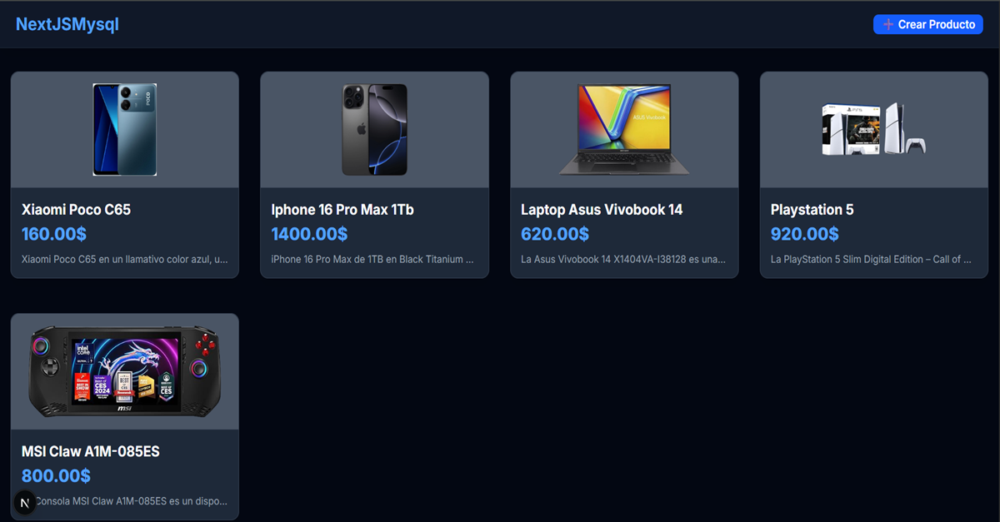
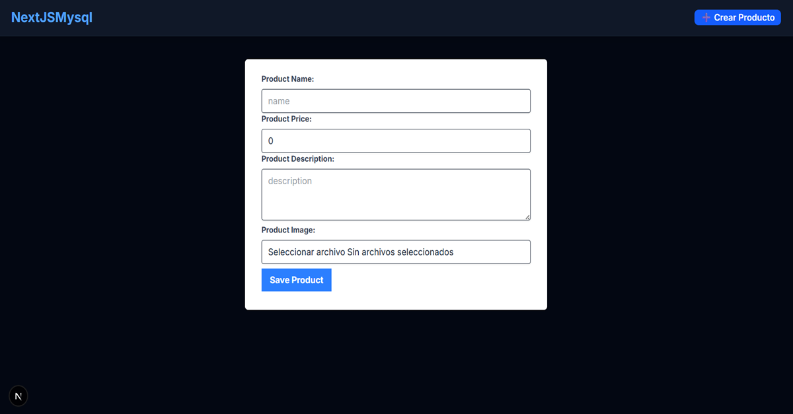
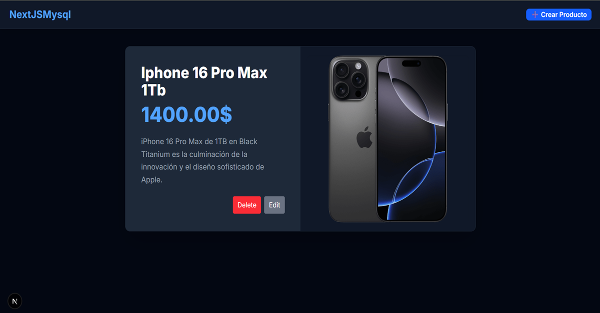

# 🚀 Full-Stack CRUD de Productos | Next.js & MySQL

Este es un proyecto **Full-Stack CRUD (Crear, Leer, Actualizar, Eliminar)** para gestionar productos. Está construido con **Next.js** (App Router) y utiliza **MySQL** como base de datos, con manejo de imágenes guardadas localmente.

---

## 💻 Stack Tecnológico

| Categoría | Tecnología | Propósito |
| :--- | :--- | :--- |
| **Frontend/Framework** | **Next.js** (App Router) | Framework de React con Server Components y Server-Side Rendering (SSR). |
| **Estilos** | **Tailwind CSS** | Utilizado para un diseño moderno y minimalista (Dark Mode). |
| **Base de Datos** | **MySQL** | Almacenamiento persistente de datos de productos. |
| **Comunicaciones** | **Axios** | Cliente HTTP para las peticiones API. |
| **Almacenamiento** | **Node.js `fs`** | Manejo de subida, reemplazo y eliminación de imágenes en el servidor local. |

---

## 📂 Características del CRUD

* **Crear (Create):** Agregar nuevos productos con nombre, precio, descripción e imagen.
* **Leer (Read):** Visualización de todos los productos en formato de tarjeta (Grid).
* **Actualizar (Update):** Edición de detalles del producto, incluyendo la sustitución de la imagen antigua por una nueva.
* **Eliminar (Delete):** Borrado del registro en la base de datos y eliminación del archivo de imagen local asociado.

---

## 🖼️ Vistas del Proyecto

### 🏠 Listado de Productos

Página principal que muestra todos los productos.



---

### ➕ Agregar Nuevo Producto

Formulario para la creación de un nuevo registro y subida de la imagen.



---

### 📝 Detalle y Edición

Página que muestra el detalle completo y permite editar o eliminar el producto.



---

## ⚙️ Cómo Ejecutar el Proyecto Localmente

Sigue estos pasos para configurar y ejecutar la aplicación en tu entorno local.

### 1. Requisitos

Asegúrate de tener instalado:
* **Node.js** (v18+)
* **MySQL Server** en ejecución.

### 2. Configuración de la Base de Datos

1.  **Crea la base de datos** y la tabla. El script SQL necesario se encuentra en la ruta:
    ```
    ./database/db.sql
    ```

### 3. Instalación y Ejecución

1.  **Clona el Repositorio:**
    ```bash
    git clone https://github.com/elmerrondon/crud-nextjs.git
    cd crud-nextjs
    ```
2.  **Instala las Dependencias:**
    ```bash
    npm install
    ```
3.  **Inicia la Aplicación en Modo Desarrollo:**
    ```bash
    npm run dev
    ```

El proyecto se abrirá en tu navegador en `http://localhost:3000`.

---

## 🚀 Despliegue (Build)

Para generar la versión optimizada de producción (Server-Side Rendering y API Routes):

```bash
npm run build